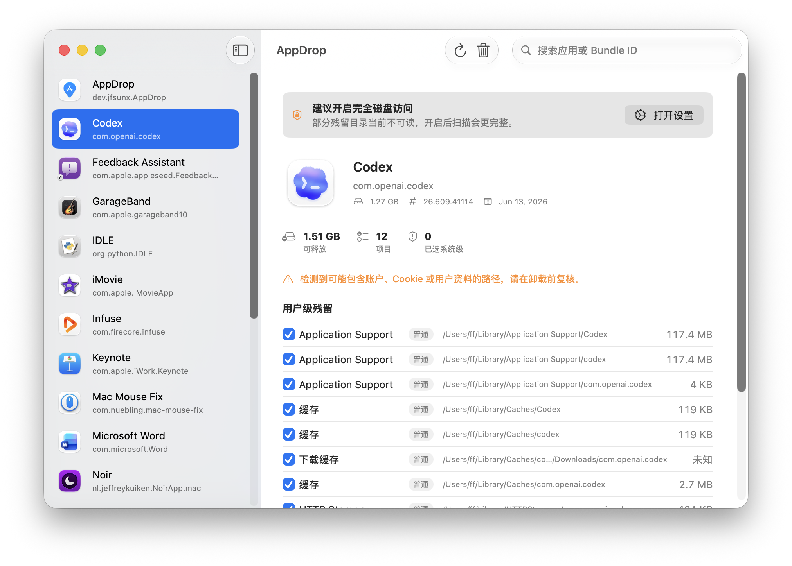

# AppDrop

<p align="center">
  
</p>

<p align="center">
  <strong>A clean, native macOS app uninstaller.</strong>
</p>

<p align="center">
  <a href="#features">Features</a> ·
  <a href="#screenshot">Screenshot</a> ·
  <a href="#install">Install</a> ·
  <a href="#permissions">Permissions</a>
</p>

AppDrop helps you uninstall macOS apps with a simple, review-first workflow. Select an app, review related files, then move the app and selected leftovers to Trash.

## Screenshot



## Features

- Native macOS app built with Swift and SwiftUI
- Clean Apple-style interface with Chinese and English support
- Fast app list: leftover files are scanned only after selecting an app
- Moves items to Trash instead of permanently deleting them
- Finds common leftovers such as preferences, caches, containers, logs, cookies, saved state, and support files
- Shows system-level leftovers separately and keeps them unchecked by default
- Marks higher-risk items so you can review before removing them
- Detects Homebrew Cask and Setapp apps and shows helpful uninstall hints
- Shows removable Apple apps while hiding protected system components
- No background daemon, no login item, no analytics, no network service

## Install

Download `AppDrop.dmg`, open it, then drag `AppDrop.app` into `Applications`.

Current builds are not signed or notarized. If macOS blocks the app after download, run:

```bash
xattr -dr com.apple.quarantine /Applications/AppDrop.app
```

Then open AppDrop again.

## Permissions

AppDrop can work without extra setup, but Full Disk Access makes leftover scanning more complete.

To enable it:

1. Open `System Settings`
2. Go to `Privacy & Security`
3. Open `Full Disk Access`
4. Add and enable `AppDrop`
5. Restart AppDrop

macOS may also ask for permission to control Finder when AppDrop moves files to Trash. Allow it if you want Finder-based Trash fallback to work.

## Safety

AppDrop is intentionally conservative:

- It moves files to Trash.
- It does not empty Trash.
- It does not install privileged helpers.
- It does not automatically remove protected system apps.
- It asks you to review files before uninstalling.

## Build

Open `AppDrop.xcodeproj` in Xcode and run the `AppDrop` scheme.

## Assets

The README uses these image paths:

- `demo/logo.png`
- `demo/main.png`

## Star History

Replace `OWNER/AppDrop` with your GitHub repository path after publishing.

<a href="https://www.star-history.com/#jfsunx/AppDrop&Date">
  <picture>
    <source media="(prefers-color-scheme: dark)" srcset="https://api.star-history.com/svg?repos=jfsunx/AppDrop&type=Date&theme=dark" />
    <source media="(prefers-color-scheme: light)" srcset="https://api.star-history.com/svg?repos=jfsunx/AppDrop&type=Date" />
    
  </picture>
</a>
